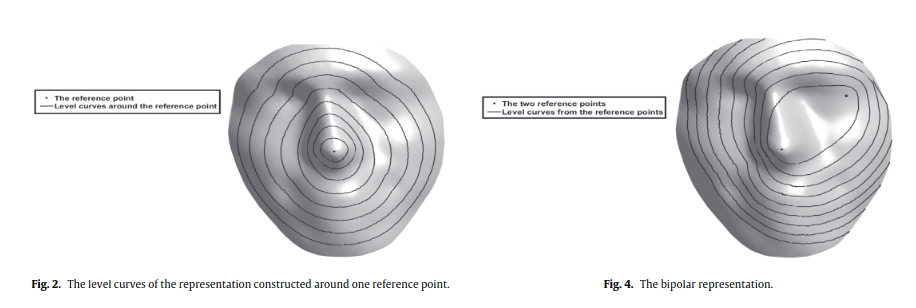
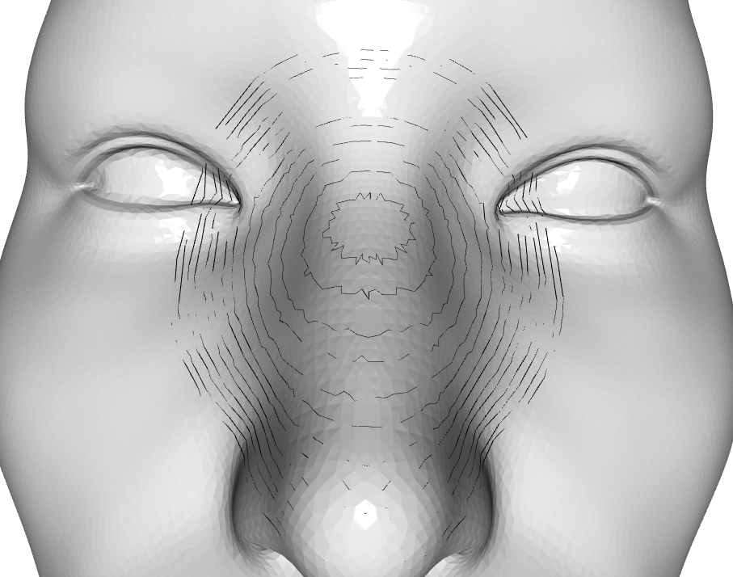
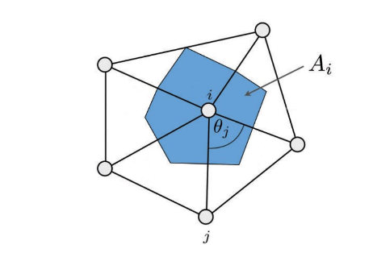
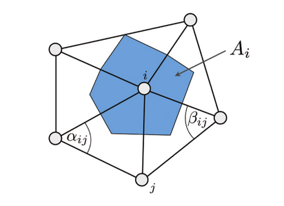

# 3D-face-recognition_Jribi2021
Implementation of the 3D face recognition algorithm described in Jribi et al. "A geodesic multipolar parameterization-based representation for 3D face recognition", 2021.

## Getting started

There are two options: Running the C++ main in /src/2021Jribi.cpp or using the python wrapper created in /src/pywrap.cpp. Attention: The MIT License only applies to the C++ implementation. As the pywrap11 library has a BSD-3 license, using the python implementation you must accept the terms stated in the BSD-3 Clause.

### Requirements

All important libraries are directly included in this directory. Although this leads to longer compilation times :d you do not need to install additional libraries for the main functions.

If you are planning to use the python wrapper, please install pybind11.

### C++ Implementation

The C++ Implementation can be run directly with the main() in /src/2021Jribi.cpp. Please change `filename` to the path pointing to your face STL File. The program will create the multipolar description and store it in `/out/levelcurves.csv`. As an example the program reloads the description just written and correlates it with the determined description. As a consequence the determined correlation must be 1 (or there was a mistake when writing / reading the file).

To run and debug the file, change the settings in CMakeLists.txt to the C++ Implementation.

### Python Implementation

To create the shared library, change the settings in CMakeLists.txt to the Python Implementation. (That's probably what's uncommented right now).

Next you can import the library and use the function like this:

```
from release.JribiDescription import jribi_description

filanameSTL = "" #path to STL file
filanameout = "" #path to were the description shall be stored
landmarks_dict = {
                        "Exocanthion_right": [0.0,0.0,0.0], #x,y,z of right outer eye corner
                        "Exocanthion_left": [0.0,0.0,0.0], 
                        "Endocanthion_right": [0.0,0.0,0.0], 
                        "Endocanthion_left": [0.0,0.0,0.0], 
                        "Pronasale": [0,0,0]}

jribi_description(filenameSTL, filenameout, landmarks_dict)
```

### Issues and debug information

Should you like more information then just the multipolar description, set `TEST_PRINT` in /inc/LevelCurves.h to true. This will print csv-files for all major steps in LevelCurves.cpp. There is also a Jupyter Notebook in /doc that you can use to visualize the csv-files with. 

Known issues:

- The STL file should only have a single mesh, thus eyes and face must be connected
- Processing time scales with mesh size. This is due to the geodesic algorithm.
- The B-Spline implementation is not very smooth. However, there is not a lot of information in the Jribi Paper so I opted for a simple library implementation. Improvements here might be a good idea.


## Code and Paper explanation

"We propose in this paper a 3D face representation which is invariant under the transformations of the 𝑆𝐸(3) group and independent to the original mesh. We implement the 3D face description proposed by jribi et al. [2], which is based on the multipolar parameterization, on many regions of the face. Fig. 2 shows an overview of the proposed representation.
Thus, the multipolar geodesic parameterization is constructed on many parts of the face that correspond to the eyes and the nose (Fig. 2(a)). This fact makes the proposed representation independent with regard to the original mesh. The proposed description consists on computing the curvature fields on each parameterization (Fig. 2(b)). A step of dimensional reduction is performed in order to reduce the cardinality of the obtained description (Fig. 2(c))." - Jribi et al. (2019)

## 1. Find inner or outer eye corner and nose

Reference points should be chosen from the static zone, which is less influenced by the expression effects and corresponds to the nose, the eyes and the forehead. The other parts of the face are considered as mimic. Jribi et al. use the nose and the two eyes as interest regions.

In Jribi et al. (2019) they choose the inner eye corner. The reason for this is, as with this configuration the distances between the same person with different expressions are smaller. However, there are more isogeodesic curves in this configuration without a clear statement as to why. This might influence the study. Nevertheless, we use the two inner eye corners as well. 

## 2. Geodesic multipolar parametrization

To store the mesh files, we use either binary or ASCII STL files. To read those files we use the open library openstl https://github.com/Innoptech/OpenSTL. To be compatible with the geodesic library we transform the triangle data stored in the STL file to vertices and faces.

### Step 1: Construction of the multipolar representation

 Level curves as decribed in Jribi 2019

Level curves are constructed by doing the following:
1. Calculate the geodesic distance of each vertices to the three (nose, inner eye corners) or two (outer eye corners and center) landmarks.
2. Calculate the sum of the geodesic distance to the landmark clusters for each point.
3. Sort vertices by the sum of distances. This creates three sorted arrays containing all vertices (or at least all vertices close to their respective landmarks).
4. Bin the vertices into equal level curves with widths of 2e. 
    - Eye region: 8 level curves with e fixed at 0.01. 
    - Nose region: 15 level with e fixed at 0.0075 with the unit unknown. 
    - In the paper e values were evaluated experimentally with the main aim being to ensure no intersection of two successive lines. They depend on the mesh. Units are unknown.

Note: As the e values units are not given in the paper and the mesh size is not fixed, we define the maximum circle size and seperate this distance into equi-level curves instead. We allow the maximum distance from the landmarks to be 1.3-times the distance between nose and eye center and 1.5-times the distance of inner to outer eye corner for the nose region and the eye region respectively. In this area we bin the data into 10*m. We ignore the last two thirds of the levels, as the propagation distance is larger than needed for most points (this is however needed, to determine distance for far-away points like the point between the eyes). Afterwards we choose m equally distributed level curves from the curves.
Result:



Determine intersecting points of the geodesic levels around the three landmarks.

### Step 2: Level curves sampling with the arc-length parameterization

5. Subsample the equal level curves
     - Eye region: 20 equidistant points per level curve
     - Nose region: 40 equidistant points per level curve

### Step 3: Calculating the local curvature

Jribi et al. use the minimum and maximum principal curvature to describe the local curvature of the sample points. In a triangular mesh, as it is the case here, the these curvatures can be computed with the Gaussian $K$ and the mean curvature $H$:

$\kappa_{max/min} = H \pm \sqrt{H²-K}$

Whith Gaussian curvature $k_g=\frac{2\pi-\sum{\theta_j}}{A_i}$

Where $A_i$ is either the barycentric cell area or the mixed voronoi cell area. Both areas describe roughly a third of the triangle. The barycentric area is a bit simpler, the voronoi area more robust. We will use the barycentric area for a start. 

Barycentric: $A_i = \frac{1}{3} \sum\limits_{T_j\isin N(i)}{area(T_j)}$ with $T_j\isin N(i)$ being the list of vertices directly adjacent to vertex i

Voronoi: http://rodolphe-vaillant.fr/entry/20/compute-harmonic-weights-on-a-triangular-mesh#mixed_voro_area



And mean curvature $H=\frac{k_min + k_max}{2}$. Alternatively the mean curvature can be determined with $|H| = \frac{||\Delta p_i||}{2}$ with $\Delta \vec{p_i} = \frac{1}{2A_i} \sum\limits_{j\isin N(i)}{(cot \alpha_{ij} + cot \beta_{ij})(p_j-p_i)}$. The mean curvature's sign then equals the sign of the dotpoint product of main vertex's normal vector (might be determined by averaging the normal vector's of the surrounding faces) and $\Delta\vec{p_i}$.



While the Gaussian Curvature is an intrinsic feature, it describes the general curvature's shape, the mean curvature is an extrinsic parameter that depends on the normal vector's orientation. Here, we'll use the normal vector that is perpendicular to the right-eye-to-left-eye distance and the face seperator (mid of eye-to-eye vector to the nose tip).

Source: http://rodolphe-vaillant.fr/entry/33/curvature-of-a-triangle-mesh-definition-and-computation

### Step 4: Comparison

Zhao et al. (2014) use similiar geodesic methods to extract landmarks within the face. They then evaluate which curvature feature can best describe the similarity between two faces by comparing the correlation results with subjective similarity determined in a human study. The deduce that the correlation of the Shape Index S best describes the similarity.

$S_I(p)=\frac{1}{2}-\frac{1}{\pi}tan^{-1}(\frac{\kappa_1(p) + \kappa_2(p)}{\kappa_1(p) - \kappa_2(p)})$

To get robust results, they use the weighted average within the vertex neighborhood. 

### Issues

Interpolated samples are equi-distant within the iso-geodesic, but do not represent the samples gained when intersecting the face with planes. While I used the B-Spline method as stated in Jribis paper, this does not fit the images given in the paper.

The paper does not mention how to correlate the output of two faces. Do to this I implemented the ideas of another paper, specifically Zhao et al. (2014) for this.

## Authors and acknowledgment

Programmer: Alexandra Mielke

Acknowledgment: I'd like to thank Florian Blümel for his input and support. He also created the test .STL file. Furthermore, I want to thank Sebastian Houben for his idea of sorting the vertices in the iso-geodesics by applying the determinant.

### 3D Face description

M. Jribi, A. Rihani, A. B. Khlifa, F. Ghorbel, "An SE(3) invariant description for 3D face recognition". 2019. In: Image and Vision Computing (89), pp. 106-119.

### OpenSTL Library

Innoptech (https://github.com/Innoptech/OpenSTL/). 

### Geodesic Library

Danil Kirsanov, https://code.google.com/archive/p/geodesic/

### SplineLib Library

M. Frings, N. Hosters, C. Müller, M. Spahn, C. Susen, K. Key, S. Elgeti, "SplineLib: A Modern Multi-Purpose C++ Spline Library". 2020. In: Advances in engineering software (146). 102826
https://github.com/SplineLib/SplineLib

### Comparison of curvature features in geodesic networks

Zhao, Junli, Liu, Cuiting, Wu, Zhongke, Duan, Fuqing, Zhang, Minqi, Wang, Kang, Jia, Taorui, 3D Facial Similarity Measure Based on Geodesic Network and Curvatures, Mathematical Problems in Engineering, 2014, 832837, 17 pages, 2014. https://doi.org/10.1155/2014/832837 

## Notes on the used libraries

### Geodesic library by Danil Kirsanov

The geodesic library organizes meshes by the neighborhood of their respective meshes, faces and edges. Objects can be adressed by ID, which just describes the position in an overall list, but also by their neighborhood. Each element has a list of adjacent objects, e.g. adjacent_faces, adjacent_vertices, adjacent_edges. These can be adressed for example by calling mesh.vertices()[id].adjacent_faces().

### OpenSTL Library

The used header can be found under main/modules/core/include/openstl/core/stl.

## License

MIT License

Permission is hereby granted, free of charge, to any person obtaining a copy
of this software and associated documentation files (the "Software"), to deal
in the Software without restriction, including without limitation the rights
to use, copy, modify, merge, publish, distribute, sublicense, and/or sell
copies of the Software, and to permit persons to whom the Software is
furnished to do so, subject to the following conditions:

The above copyright notice and this permission notice shall be included in all
copies or substantial portions of the Software.

THE SOFTWARE IS PROVIDED "AS IS", WITHOUT WARRANTY OF ANY KIND, EXPRESS OR
IMPLIED, INCLUDING BUT NOT LIMITED TO THE WARRANTIES OF MERCHANTABILITY,
FITNESS FOR A PARTICULAR PURPOSE AND NONINFRINGEMENT. IN NO EVENT SHALL THE
AUTHORS OR COPYRIGHT HOLDERS BE LIABLE FOR ANY CLAIM, DAMAGES OR OTHER
LIABILITY, WHETHER IN AN ACTION OF CONTRACT, TORT OR OTHERWISE, ARISING FROM,
OUT OF OR IN CONNECTION WITH THE SOFTWARE OR THE USE OR OTHER DEALINGS IN THE
SOFTWARE.

Geodesic: Copyright (C) 2008 Danil Kirsanov, MIT License

OpenSTL: Copyright (c) 2024 Innoptech, MIT License

SplineLib: Copyright (c) 2018–2021 SplineLib, MIT License

Library modifications and all other parts of the code: Copyright (c) 2024 Alexandra Mielke, MIT License